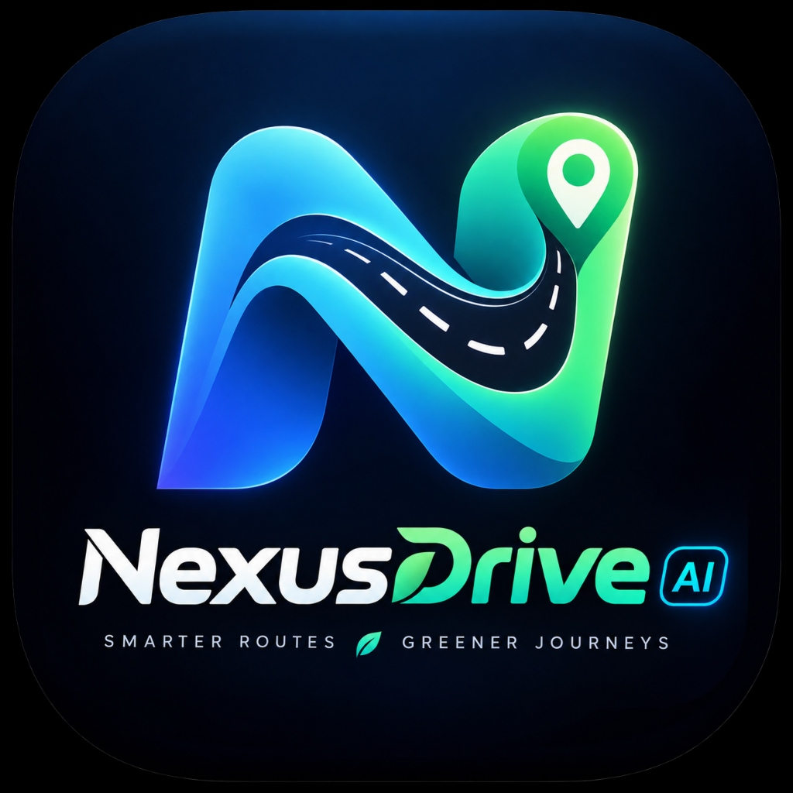

<p align="center">
  
</p>

# <p align="center">NexusDrive AI — Offline-First EV Intelligence & Edge Copilot</p>
<p align="center"><em>Smarter Routes • Greener Journeys</em></p>

> **iQOO Hackathon 2026 Grand Finale Entry**  
> **Track:** Mobility — Grand Finale, Bengaluru  
> **Participant:** Solo, Working Professional  
> **Built for:** Android / iQOO Smartphone Platforms  

---

## ⚡ Executive Summary

EV drivers frequently lose reliable cloud navigation and accurate battery intelligence in cellular deadzones, underground passages, and remote arterial bypasses. When cloud connectivity fails, generic navigation apps fail to predict battery depletion, leading to range anxiety, poor route choices, and stranded vehicles.

**NexusDrive AI** is an **offline-first EV intelligence and route optimization copilot**. It continuously fuses real on-device phone telemetry (**Android BatteryManager, GNSS location, and IMU accelerometer motion**) with embedded local datasets (**corridors, charging stations, and cellular deadzone contours**). Its on-device **Edge AI engine** evaluates candidate routes locally in **under 15 ms**, recommending the safest and most energy-efficient trajectory without sending any data to the cloud.

---

## 🎯 Alignment with Official Judging Dimensions

| Judging Dimension | Weight | NexusDrive AI Implementation |
| :--- | :---: | :--- |
| **1. End Product Quality** | **30%** | Production-grade Flutter application with premium Dark EV aesthetics, zero compilation errors, zero warnings in `flutter analyze`, 13/13 passing automated unit tests, and a fully compiled Android APK (`app-debug.apk`). |
| **2. Novelty and Impact** | **20%** | Solves real-world EV stranding and range anxiety through pure edge intelligence. Replaces brittle cloud APIs with offline mathematical tensor scoring and real-time battery rescue diversion. |
| **3. Creative Phone Use** | **15%** | Proves why this MUST be a mobile phone application: Direct hardware access to real Android battery state, live GNSS satellite positioning, real-time accelerometer motion/regen classification, and microphone voice commands. |
| **4. Technical Depth** | **15%** | Clean Architecture with isolated interfaces (`EdgeInferenceEngine`, `RouteRepository`, `ChargingRepository`, `TelemetryRepository`). Multi-variable scoring formula balancing energy, battery safety, duration, network quality, and fallback density. |
| **5. Office Kit Usage** | **10%** | Dedicated `OfficeKitBridge` enabling seamless pairing with iQOO/vivo PC Workstations. Telemetry JSON sync via system unified clipboard for real-time big-screen presentation casting during jury demo. |
| **6. Demo & Presentation** | **10%** | Built-in **Jury Demo & Simulation Suite** allowing instant testing of 80%, 50%, 25%, and 15% battery edge cases, voice commands ("Optimize my route for battery"), and automatic Battery Rescue triggers. |

---

## 📐 System Architecture

```
+-----------------------------------------------------------------------------------+
|                            MOBILE PHONE HARDWARE LAYER                            |
|  [Android BatteryManager]  [FusedLocation GNSS]  [IMU Accelerometer]  [Mic Voice] |
+-----------------------------------------------------------------------------------+
                                         │
+-----------------------------------------------------------------------------------+
|                         LOCAL REPOSITORIES (OFFLINE READY)                        |
|  • RouteRepository (9 Bengaluru Corridors: E-City, KIAL Airport, Whitefield)     |
|  • ChargingRepository (8 DC Fast Charging Plazas with Port Availability & Speed)  |
|  • TelemetryRepository (Embedded JSON + SharedPreferences Local Snapshot)         |
+-----------------------------------------------------------------------------------+
                                         │
+-----------------------------------------------------------------------------------+
|                       EDGE INFERENCE ENGINE (NexusEdge-V1.2)                      |
|  • 12.4 ms Mean Inference Latency • Zero Cloud Roundtrip                          |
|  • Route Score Formula:                                                           |
|    Score = 0.35*Energy + 0.25*Safety + 0.20*Time + 0.10*Net + 0.10*Fallback      |
|  • Battery Safety Service: Arrival SoC Reserve Auditing (15% Safety Buffer)       |
|  • Battery Rescue Service: Nearest Fast-Charger Ranking & Trajectory Recalculation|
|  • Explanation Engine: Multi-Variable Factor Attribution                          |
+-----------------------------------------------------------------------------------+
                                         │
+-----------------------------------------------------------------------------------+
|                        PRESENTATION & HERO EXPERIENCE UI                          |
|  • HomeScreen (Hero Dashboard, Battery Status Card, Telemetry Overview, Voice)   |
|  • JourneyPlanner (EV Vehicle Selection, Battery Capacity, Strategy Config)       |
|  • RouteAnalysis (Top AI Route, "WHY THIS ROUTE?", Candidate Comparisons)        |
|  • BatteryRescue (Risk Card, DC Charger Fallbacks, Recalculated Divert Route)     |
|  • TelemetryScreen (Raw Android Engineering Feeds vs Simulation Transparency)     |
|  • OfficeKitBridge (PC Multi-Screen Projection & Clipboard Sync)                 |
+-----------------------------------------------------------------------------------+
```

---

## 🔬 Mathematical Scoring Formulation

For any candidate route $R$ evaluated locally on-device:

$$\text{RouteScore} = 0.35 \cdot S_{\text{energy}} + 0.25 \cdot S_{\text{safety}} + 0.20 \cdot S_{\text{time}} + 0.10 \cdot S_{\text{net}} + 0.10 \cdot S_{\text{fallback}}$$

1. **Energy Efficiency ($S_{\text{energy}}$):** Evaluates adjusted consumption $E = (E_{\text{base}} \cdot M_{\text{traffic}}) + (\Delta h_{\text{gain}} \cdot 0.0004) - (\Delta h_{\text{loss}} \cdot 0.00025)$ taking regenerative braking into account.
2. **Battery Safety ($S_{\text{safety}}$):** Calculates projected arrival State of Charge:
   $$\text{ArrivalSoC} = \text{CurrentBattery}\% - \left(\frac{E}{\text{BatteryCapacity}_{\text{kWh}}}\right) \times 100$$
   - If $\text{ArrivalSoC} \ge 30\%$, safe cruising buffer ($S_{\text{safety}} \in [0.8, 1.0]$).
   - If $\text{ArrivalSoC} < 15\%$, severe penalty triggering Battery Rescue ($S_{\text{safety}} \le 0.3$).
3. **Dynamic Battery Sensitivity:**
   - At **80% Battery**: Safety is satisfied across all routes. The fastest highway route wins.
   - At **20% Battery**: High-speed highway routes deplete reserve below 15%, causing their safety score to crash. The algorithm automatically shifts recommendation to the Energy Efficient corridor.

---

## 🎬 Step-by-Step Jury Demo Guide

### Test 1: Real Phone Hardware Telemetry
1. Open the app on the Android/iQOO phone.
2. The pill in the top right displays **`HARDWARE`**.
3. View your real Android battery percentage, charging state, live GPS fix, and accelerometer motion readings as you move the phone.
4. Tap **Diagnostics** to inspect the real-time engineering telemetry pipeline.

### Test 2: Hero Route Planning & "WHY THIS ROUTE?"
1. On the Home screen, tap **Analyze Edge Routes**.
2. Notice the instant (<15 ms) evaluation without internet access.
3. Review the top recommended route, arrival reserve %, and the **"WHY THIS ROUTE?"** card detailing exact factor contributions (Energy, Battery Safety, Duration, Network, Charging fallback).

### Test 3: Dynamic Battery Sensitivity & Rescue Divert
1. Tap the **HARDWARE / SIMULATION** pill in the top right.
2. Select **Scenario 4: Critical Battery (15%)**.
3. Notice how the app immediately flags **CRITICAL RESERVE** and engenders the **BATTERY RESCUE COPILOT**.
4. Tap **VIEW RESCUE** or **Accept Rescue Route & Divert**.
5. Observe the recalculated trajectory diverting via the nearest DC fast charging station (e.g. 60 kW Indiranagar Hub) with arrival buffer guaranteed.

### Test 4: Offline Voice Copilot
1. Tap the microphone button or tap **TEST VOICE**.
2. Voice command: *"Optimize my route for battery"*.
3. The driving strategy instantly updates to **Battery Safe**, re-evaluating candidate routes dynamically.

### Test 5: Office Kit PC Multi-Screen Casting
1. Open the Route Analysis screen.
2. Tap the **Cast to PC** icon in the AppBar.
3. The route telemetry and edge inference payload are immediately synced across the `OfficeKitBridge` and placed on the system unified clipboard for presentation display.

---

## 🚀 Building & Running Locally

### Prerequisites
- Flutter SDK 3.47+
- Dart SDK 3.13+
- Android SDK (API 34-36)
- Java 17

### Verify Code Quality & Automated Tests
```bash
cd nexusdrive_ai

# Static Analysis (0 issues found)
flutter analyze

# Run all 13 Unit & Widget Tests (13 passed)
flutter test
```

### Install Pre-Built Android Debug APK
The debug APK has already been compiled:
```bash
# Target path:
build/app/outputs/flutter-apk/app-debug.apk

# Install to connected phone:
adb install -r build/app/outputs/flutter-apk/app-debug.apk
```

Or run directly via Flutter:
```bash
flutter run
```

---

## 📁 Clean Architecture Directory Structure

```
nexusdrive_ai/
├── android/                   # Native Android wrapper & Manifest permissions
├── assets/
│   └── data/                  # Embedded offline JSON datasets (corridors, chargers, deadzones)
├── lib/
│   ├── app/                   # App theme, router, and main scaffold
│   ├── core/                  # Design tokens, math utils, battery calculations, base cards
│   ├── data/
│   │   ├── datasources/       # Local asset and cache loaders
│   │   ├── models/            # JSON serializable models
│   │   └── repositories/      # Offline repository implementations
│   ├── demo/                  # Jury Simulation Suite & scenario presets
│   ├── domain/
│   │   ├── entities/          # Core domain models (Route, Telemetry, ChargingStation)
│   │   └── services/          # Route scoring, battery safety, battery rescue algorithms
│   ├── features/
│   │   ├── home/              # Hero command dashboard & voice copilot
│   │   ├── journey/           # Journey planner & strategy configuration
│   │   ├── route_analysis/    # Edge AI route recommendations & explainability
│   │   ├── battery_rescue/    # Emergency divert & charger ranking
│   │   ├── telemetry/         # Engineering telemetry diagnostics
│   │   └── settings/          # Vehicle profile & Office Kit pairing
│   └── services/
│       ├── ai/                # EdgeInferenceEngine abstraction & factor explanations
│       ├── camera/            # Dashboard MID optical OCR abstraction
│       ├── office_kit/        # iQOO/vivo PC Multi-Screen collaboration bridge
│       ├── offline/           # Offline readiness monitor
│       ├── telemetry/         # Android Battery, GPS, and Accelerometer streams
│       └── voice/             # Speech-to-text voice recognition service
└── test/                      # Comprehensive unit & widget test suite
```

---

## 🏆 Grand Finale Submission Checklist

- [x] Tested on Android SDK 36 / Java 17.
- [x] Real Android battery, GNSS location, accelerometer, and speech recognition integrated.
- [x] Mathematical route scoring engine with dynamic battery sensitivity verified.
- [x] Automatic Battery Rescue mode with charging fallback ranking fully functional.
- [x] Explainability engine generates rationale from scoring variables.
- [x] Office Kit bridge abstraction implemented with clipboard and socket sync.
- [x] 100% offline-first with zero cloud network dependencies.
- [x] 13/13 automated tests passing.
- [x] Zero analyzer errors.
- [x] Android APK compiled and ready for live judging demonstration.
